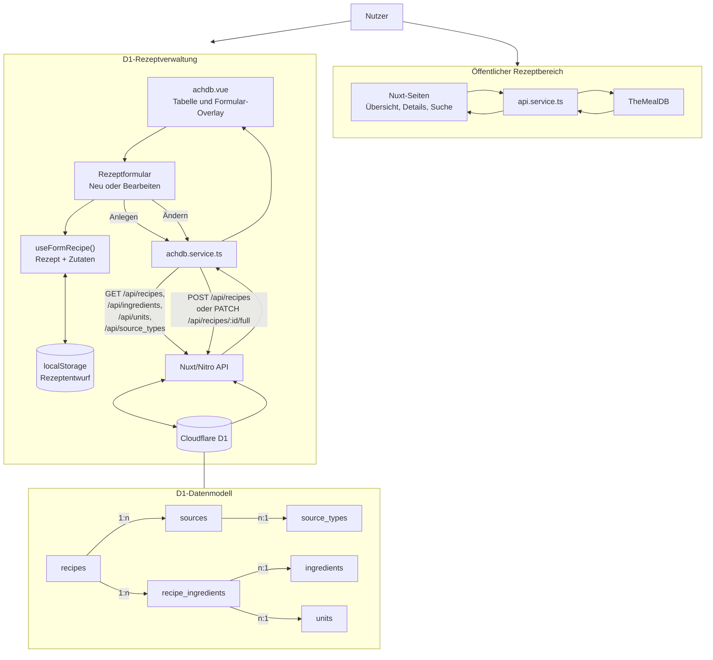

# Soll-Zustand des Projekts

```mermaid
flowchart TD
    User["Nutzer"]

    subgraph Public["Öffentlicher Rezeptbereich"]
        Pages["Nuxt-Seiten<br/>Übersicht, Details, Suche"]
        ApiService["api.service.ts"]
        MealDB["TheMealDB"]
        Pages --> ApiService --> MealDB
        MealDB --> ApiService --> Pages
    end

    subgraph Admin["D1-Rezeptverwaltung"]
        AchdbPage["achdb.vue<br/>Tabelle und Formular-Overlay"]
        Editor["Rezeptformular<br/>Neu oder Bearbeiten"]
        FormState["useFormRecipe()<br/>Rezept + Zutaten"]
        Draft[("localStorage<br/>Rezeptentwurf")]
        DbService["achdb.service.ts"]
        Nitro["Nuxt/Nitro API"]
        D1[("Cloudflare D1")]

        AchdbPage --> Editor
        Editor --> FormState
        FormState <--> Draft
        Editor -->|Anlegen| DbService
        Editor -->|Ändern| DbService
        DbService -->|GET /api/recipes,<br/>/api/ingredients,<br/>/api/units,<br/>/api/source_types| Nitro
        DbService -->|POST /api/recipes<br/>oder PATCH /api/recipes/:id/full| Nitro
        Nitro <--> D1
        D1 --> Nitro --> DbService --> AchdbPage
    end

    User --> Public
    User --> Admin

    subgraph DataModel["D1-Datenmodell"]
        Recipes["recipes"]
        Sources["sources"]
        SourceTypes["source_types"]
        RecipeIngredients["recipe_ingredients"]
        Ingredients["ingredients"]
        Units["units"]

        Recipes -->|1:n| Sources
        Sources -->|n:1| SourceTypes
        Recipes -->|1:n| RecipeIngredients
        RecipeIngredients -->|n:1| Ingredients
        RecipeIngredients -->|n:1| Units
    end

    D1 --- DataModel
```
